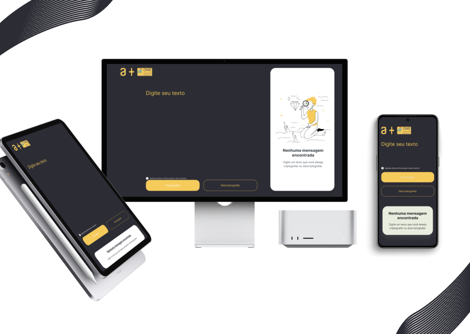

# Decodificador - Alura + ONE

Este é um projeto proposto pela Alura + ONE após 2 formações que totalizaram mais de 80 horas de conteudo. 

- O desafio consistia em criar uma aplicação que permitisse o usuário criptografar e descriptografar mensagens!

### Como requisitos a aplicação deveria:

- Funcionar apenas com letras minúsculas e sem acentos

- Ser possível converter uma palavra para a versão criptografada e também retornar uma palavra criptografada para a versão original.

        Por exemplo:
        "ola" => "oberlai"
        oberlai" => "ola"

- Ter o resultado deve ser exibido na tela.

## Demonstração

Além disso, a aplicação pode ser testada em:  

## Skills aprendidas

Através desse projeto pude rever conceitos de estrutura HTML, decoração do site utilizando CSS, Flexbox, Grid e explorar conceitos de javaScript.

Principais aprendizados:

  - Aplicar e retirar estilos em tags no HTML com javascript;
  - Criação e remoção de tags HTML com javascript
  - Funções match, split, replace;
  - Utilização de expressões regulares para especificar quais caracteres podem user utilizados
  - Como copiar uma area de texto; 
  - Posicionamento de elementos na tela utilizando Flebox e Grid

## Tecnologias

